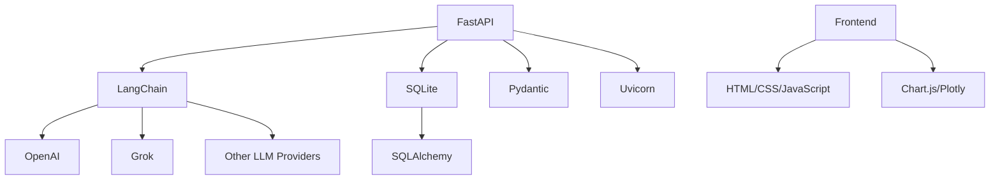
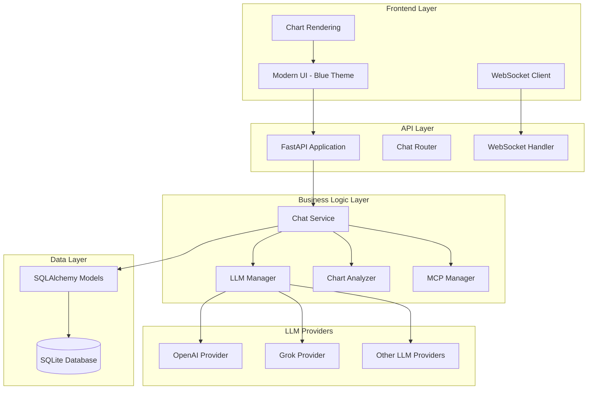
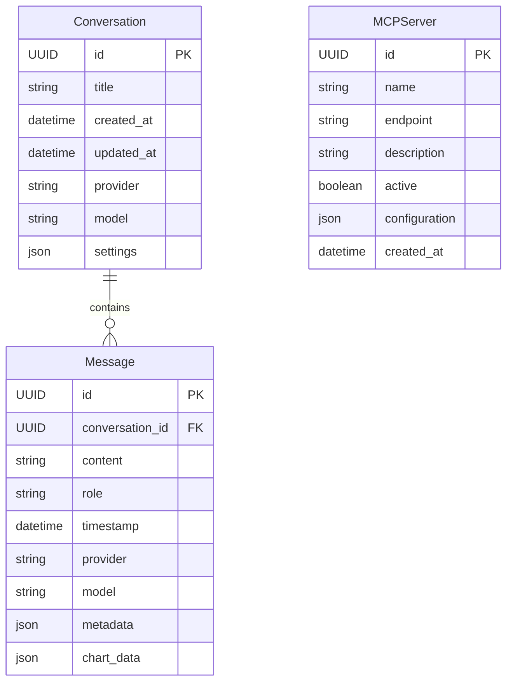
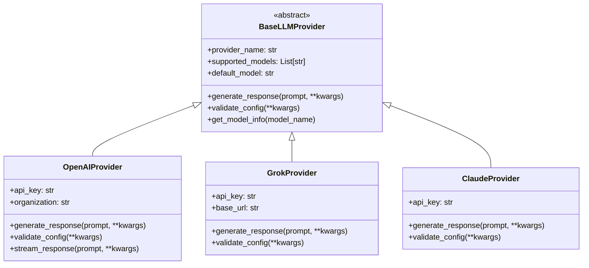
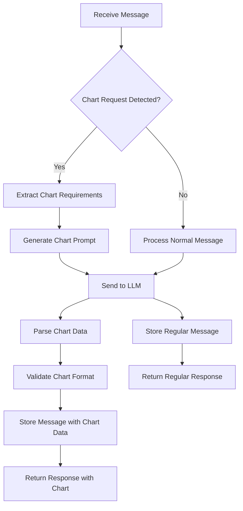
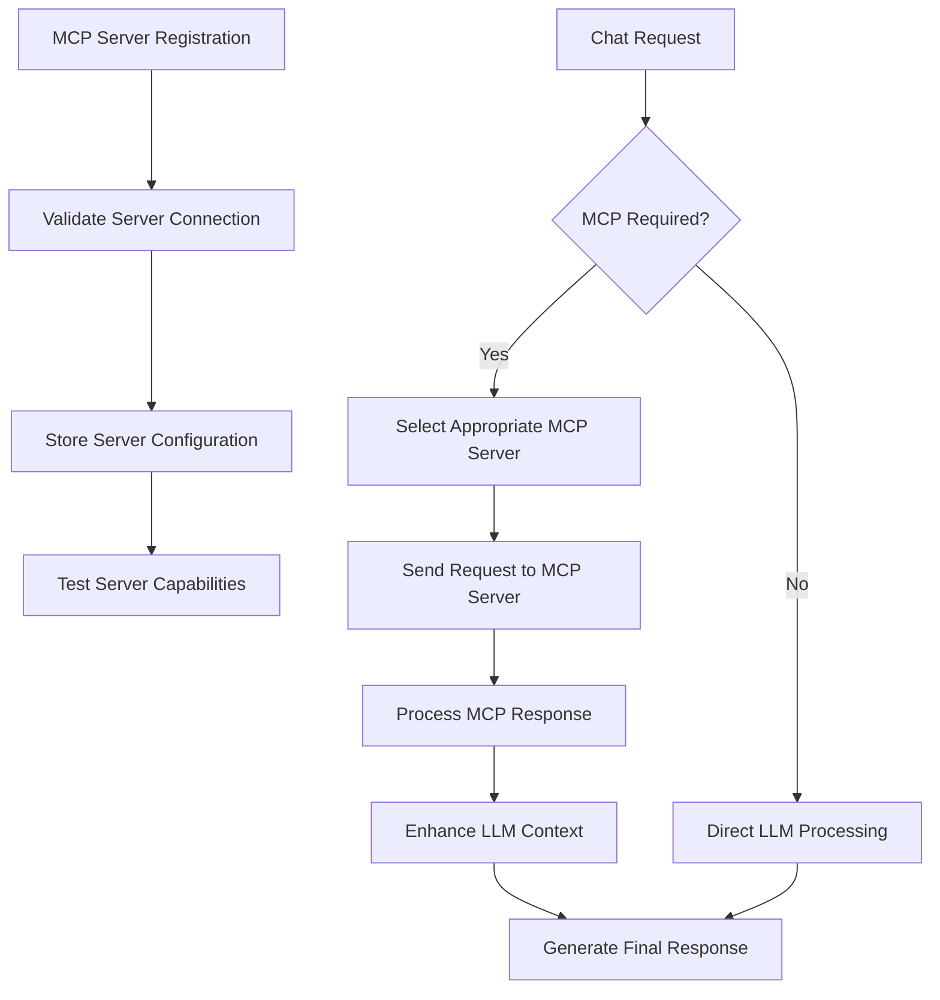
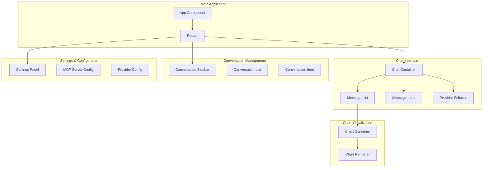
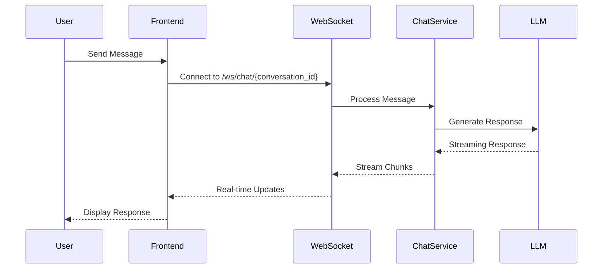
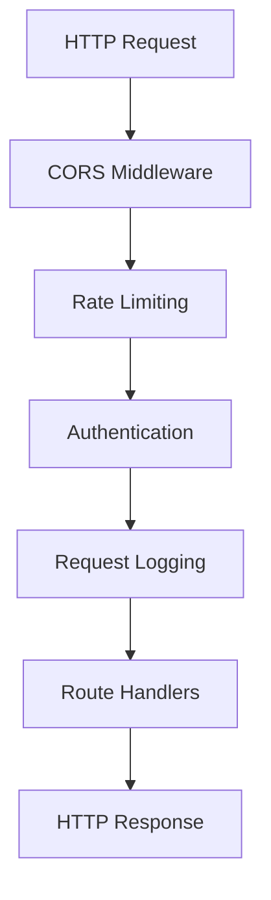
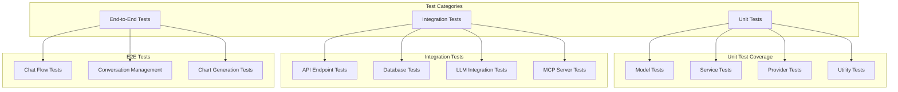

# FastAPI LangChain Chatbot Design Document

## Overview

The FastAPI LangChain Chatbot is a modern web application that provides a chat interface for interacting with various Large Language Models (LLMs) through a unified interface. The application leverages LangChain for LLM integration, supports multiple AI providers, conversation management, MCP server integration, and automatic chart generation capabilities.

### Key Features
- Multi-provider LLM support (OpenAI, Grok, etc.)
- Conversation persistence and management
- MCP (Model Context Protocol) server integration
- Automatic chart generation based on user requests
- Modern minimalist UI with blue color scheme
- SQLite database for data persistence

## Technology Stack & Dependencies



### Core Dependencies
- **FastAPI**: Web framework for API development
- **LangChain**: LLM orchestration and integration
- **SQLAlchemy**: ORM for database operations
- **SQLite**: Lightweight database for persistence
- **Pydantic**: Data validation and serialization
- **Uvicorn**: ASGI server for FastAPI
- **Jinja2**: Template engine for HTML rendering

### Frontend Dependencies
- **Chart.js** or **Plotly.js**: Chart visualization library
- **Modern CSS Framework**: For blue-themed minimalist design
- **WebSocket**: Real-time communication with backend

## Architecture

### High-Level Architecture



### Directory Structure

```
app/
├── main.py                 # FastAPI application entry point
├── config/
│   ├── __init__.py
│   ├── settings.py         # Application configuration
│   └── database.py         # Database configuration
├── models/
│   ├── __init__.py
│   ├── conversation.py     # Conversation data model
│   ├── message.py          # Message data model
│   └── mcp_server.py       # MCP server data model
├── providers/
│   ├── __init__.py
│   ├── base.py             # Base LLM provider interface
│   ├── openai_provider.py  # OpenAI integration
│   ├── grok_provider.py    # Grok integration
│   └── claude_provider.py  # Claude integration (example)
├── services/
│   ├── __init__.py
│   ├── chat_service.py     # Chat business logic
│   ├── llm_manager.py      # LLM provider management
│   ├── chart_analyzer.py   # Chart generation logic
│   └── mcp_manager.py      # MCP server management
├── routers/
│   ├── __init__.py
│   ├── chat.py             # Chat API endpoints
│   ├── conversations.py    # Conversation management
│   └── mcp.py              # MCP server endpoints
├── schemas/
│   ├── __init__.py
│   ├── chat.py             # Chat request/response schemas
│   ├── conversation.py     # Conversation schemas
│   └── mcp.py              # MCP schemas
├── static/
│   ├── css/
│   │   └── style.css       # Blue-themed CSS
│   ├── js/
│   │   ├── chat.js         # Chat interface logic
│   │   ├── charts.js       # Chart rendering logic
│   │   └── websocket.js    # WebSocket handling
│   └── images/
├── templates/
│   ├── index.html          # Main chat interface
│   ├── conversations.html  # Conversation management
│   └── settings.html       # MCP and provider settings
└── utils/
    ├── __init__.py
    ├── exceptions.py       # Custom exceptions
    └── helpers.py          # Utility functions
```

## API Endpoints Reference

### Chat Endpoints

| Method | Endpoint | Description | Authentication |
|--------|----------|-------------|----------------|
| GET | `/` | Main chat interface | None |
| POST | `/api/chat/send` | Send message to LLM | None |
| GET | `/api/chat/conversations` | List all conversations | None |
| POST | `/api/chat/conversations` | Create new conversation | None |
| DELETE | `/api/chat/conversations/{id}` | Delete conversation | None |
| WebSocket | `/ws/chat/{conversation_id}` | Real-time chat | None |

### MCP Server Endpoints

| Method | Endpoint | Description | Authentication |
|--------|----------|-------------|----------------|
| GET | `/api/mcp/servers` | List MCP servers | None |
| POST | `/api/mcp/servers` | Add MCP server | None |
| DELETE | `/api/mcp/servers/{id}` | Remove MCP server | None |
| PUT | `/api/mcp/servers/{id}` | Update MCP server | None |

### Request/Response Schemas

#### Chat Message Request
```json
{
  "message": "string",
  "conversation_id": "uuid",
  "provider": "openai|grok|claude",
  "model": "string",
  "temperature": 0.7,
  "max_tokens": 1000
}
```

#### Chat Message Response
```json
{
  "id": "uuid",
  "content": "string",
  "role": "assistant",
  "timestamp": "datetime",
  "provider": "string",
  "model": "string",
  "chart_data": {
    "type": "bar|line|pie",
    "data": {},
    "options": {}
  }
}
```

## Data Models & ORM Mapping

### Conversation Model



### SQLAlchemy Models

#### Conversation Model
- `id`: Primary key (UUID)
- `title`: Conversation title
- `created_at`: Creation timestamp
- `updated_at`: Last update timestamp
- `provider`: Default LLM provider
- `model`: Default model name
- `settings`: JSON field for provider-specific settings

#### Message Model
- `id`: Primary key (UUID)
- `conversation_id`: Foreign key to Conversation
- `content`: Message text content
- `role`: Message role (user/assistant/system)
- `timestamp`: Message timestamp
- `provider`: LLM provider used
- `model`: Model used for generation
- `metadata`: JSON field for additional data
- `chart_data`: JSON field for chart information

#### MCP Server Model
- `id`: Primary key (UUID)
- `name`: Server display name
- `endpoint`: Server URL/connection string
- `description`: Server description
- `active`: Boolean flag for enable/disable
- `configuration`: JSON field for server-specific config
- `created_at`: Creation timestamp

## Business Logic Layer

### LLM Provider Architecture



### Chat Service Logic



### Chart Analysis Service

The Chart Analyzer automatically detects when users want to display charts and generates appropriate prompts for the LLM.

#### Chart Detection Patterns
- Keywords: "график", "chart", "plot", "визуализация", "диаграмма"
- Data patterns: Numbers, statistics, comparisons
- Request types: "покажи", "отобрази", "нарисуй", "построй"

#### Chart Generation Workflow
1. **Detection**: Analyze user message for chart indicators
2. **Data Extraction**: Identify data points and relationships
3. **Prompt Generation**: Create specialized LLM prompt for chart data
4. **Response Processing**: Parse LLM response for chart configuration
5. **Validation**: Ensure chart data format is valid
6. **Frontend Rendering**: Send chart data to frontend for visualization

### MCP Server Integration



## Frontend Architecture

### Component Structure



### Blue Color Scheme

```css
:root {
  --primary-blue: #2563eb;
  --secondary-blue: #3b82f6;
  --light-blue: #dbeafe;
  --dark-blue: #1e40af;
  --accent-blue: #60a5fa;
  --background: #f8fafc;
  --text-primary: #1e293b;
  --text-secondary: #64748b;
  --border-color: #e2e8f0;
}
```

### WebSocket Integration



## Middleware & Configuration

### FastAPI Middleware Stack



### Configuration Management

#### Environment Variables
- `DATABASE_URL`: SQLite database path
- `OPENAI_API_KEY`: OpenAI API key
- `GROK_API_KEY`: Grok API key
- `CLAUDE_API_KEY`: Claude API key
- `DEBUG`: Debug mode flag
- `LOG_LEVEL`: Logging level
- `CORS_ORIGINS`: Allowed CORS origins

#### Provider Configuration
Each LLM provider will have its own configuration class with validation:

```python
class OpenAIConfig:
    api_key: str
    organization: Optional[str]
    base_url: Optional[str]
    default_model: str = "gpt-3.5-turbo"
    temperature: float = 0.7
    max_tokens: int = 1000
```

## Testing Strategy

### Unit Testing



### Test Framework Setup
- **pytest**: Main testing framework
- **pytest-asyncio**: Async test support
- **httpx**: HTTP client for API testing
- **pytest-mock**: Mocking capabilities
- **coverage**: Code coverage reporting

### Key Test Areas

#### Provider Testing
- Mock LLM responses for consistent testing
- Validate provider configuration
- Test error handling and retries
- Test streaming responses

#### Chat Service Testing
- Message processing logic
- Chart detection algorithms
- Conversation persistence
- MCP server integration

#### Frontend Testing
- WebSocket connection handling
- Chart rendering functionality
- User interaction flows
- Responsive design validation

### Test Data Management
- Use fixtures for database test data
- Mock external API responses
- Create test conversations and messages
- Provide sample chart data for testing